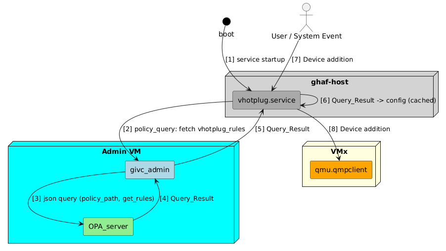
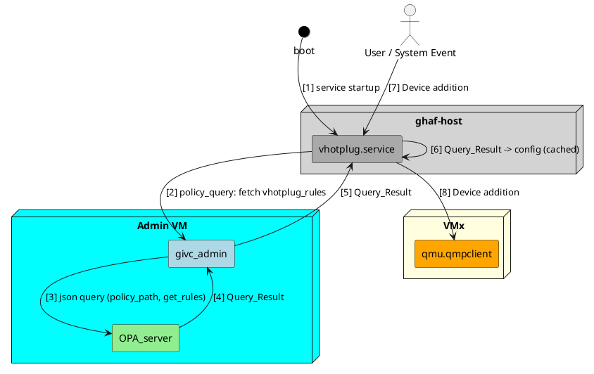

# Centralized Policy Management Framework for Ghaf

## 1. Overview

This document outlines the architecture for a **centralized policy management system** in Ghaf. The design ensures that VMs can query and enforce security and operational policies without directly accessing the policy engine (OPA). The existing `givc-admin` service now acts as a secure policy gateway too. A command line option has been added to 'givc-cli' to query a policy.  

## 2. Architectural Goals

- **Centralized Policy Evaluation:** All policy decisions are made centrally for consistency and auditability.
- **Secure channel** VMs can use existing `givc-cli` option to query any policy. We use existing mTLS secured gRPC implemented by `givc-admin`.
- **Minimal Overhead:** Any application/service can safely cache the policies if they have mechanism to accept policy update notification to minimize the transactions.
- **Complex Query Handling:** Provides mechanism to add new commands, which can be used instead of complex queries.
- **Live Policy Enforcement:** The application will provide mechanism to update the policy in a live system.
- **Extensibility:** Designed to support various use cases.

## 3. High-Level Component Diagram

## 4. Component Descriptions

### OPA Server (Admin VM)
- The Open Policy Agent is responsible for evaluating all policy queries.
- Uses Rego-based policies stored on URL, and verifies it's hash.

### Existing givc-admin (Admin VM)
- Additional command with subcommands introduced to query any policy.

###  Policy based vHotPlug rules 
- Sends `policy_query` requests to `givc-admin` at service startup.
- Interprets and caches policy decisions locally to act on user/system events.
- Executes actions such as device passthrough based on the policy rules.

## 5. Design Decisions

### Use of `givc-admin` Interface (Not Direct OPA Exposure)

| Reason              | Justification                                                                 |
|---------------------|--------------------------------------------------------------------------------|
| **givc-admin gateway**  | No need to setup separate secure network for policy evaluation. Using `givc-admin`, we can validate, sanitize, and normalize queries before they reach OPA. |
| **Auditing**         | We can enables centralized logging of all policy interactions.                      |
| **Modularity**       | Easier to update or scale OPA behind `givc-admin` without changing client services. |

## 6. Example Policy Query Flow (vHotplug Use Case)

1. `vhotplug.service` starts and sends a policy query to `givc-admin`.
2. `givc-admin` forwards this as a JSON request to `OPA_server`.
3. `OPA_server` evaluates the query and returns a decision.
4. `givc-admin` relays the result back to the requesting service.
5. The service configures itself according to the policy (e.g., allow only USB class X).
6. When a device is added, the cached configuration is used to permit or deny the operation.
7. (Future Update) When there is any policy update notification update the cached policy.

## 7. Benefits

- Policy enforcement is **centralized**, **auditable**, and **extensible**.
- The architecture is **modular**, allowing additional services to become policy-aware.

## 8. Future Enhancements

- Use OPAL for dynamic policy updates.
- Add **policy versioning and rollback** mechanisms.
